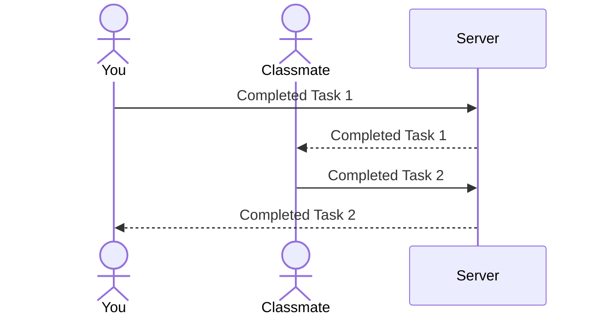

# Group Goal

[My Notes](notes.md)

> [!NOTE]
>  This is a template for your startup application. You must modify this `README.md` file for each phase of your development. You only need to fill in the section for each deliverable when that deliverable is submitted in Canvas. Without completing the section for a deliverable, the TA will not know what to look for when grading your submission. Feel free to add additional information to each deliverable description, but make sure you at least have the list of rubric items and a description of what you did for each item.

> [!NOTE]
>  If you are not familiar with Markdown then you should review the [documentation](https://docs.github.com/en/get-started/writing-on-github/getting-started-with-writing-and-formatting-on-github/basic-writing-and-formatting-syntax) before continuing.

## 🚀 Specification Deliverable

> [!NOTE]
>  Fill in this sections as the submission artifact for this deliverable. You can refer to this [example](https://github.com/webprogramming260/startup-example/blob/main/README.md) for inspiration.

For this deliverable I did the following. I checked the box `[x]` and added a description for things I completed.

- [x] Proper use of Markdown - Took some going back and editing, but I think I got it!
- [x] A concise and compelling elevator pitch - done!
- [x] Description of key features - done!
- [x] Description of how you will use each technology - done!
- [x] One or more rough sketches of your application. Images must be embedded in this file using Markdown image references. - I made sure to embed the image!

### Elevator pitch

Have you found yourself exhausted trying to motivate friends, classmates, or coworkers to work on a goal together? Maybe you and your friends want to start saving for that dream trip, or you and your classmates need to get started on that project. The Group Goal application is for users to stay consistent and motivated towards achieving their goals as a team. Users can set personalized goals for their group and keep each other accountable. As users check off tasks, progress is shared live with the group. With everyone working together, goals can finally become reality.

### Design

Here's a sequence diagram that shows how a group of two would interact with the backend to update progress of their goal.

### Key features

- Secure login over HTTPS
- Ability to create group goals
- Check off tasks
- Live group progress
- Ability for admin to create and delete group goals

### Technologies

I am going to use the required technologies in the following ways.

- **HTML** - Uses correct HTML structure for the application. Two HTML pages. One for login and one for habit dashboard. Includes hyperlinks to group progress and habit setup.
- **CSS** - Responsive styling for mobile and desktop. Clean layout with readable fonts, whitespace, and color-coded status. Visual feedback for completed tasks and group activity
- **React** - React components for login, goal list, task check-off, group feed, and use of React for routing and components.
- **Service** - Backend service with endpoints for:
  - login
  - retrieve group goals
  - create a new group goal
  - mark a task as complete
  - get group progress and contributions

- **DB/Login** - Stores users, group goals, and task completion status in database. Register and login users. Credentials securely stored in database. Users must be authenticated to view or update goals.
- **WebSocket** - As users mark tasks complete, the update is broadcast to all group members in real time. 

## 🚀 AWS deliverable

For this deliverable I did the following. I checked the box `[x]` and added a description for things I completed.

- [x] **Server deployed and accessible with custom domain name** - [My server link](https://groupgoal.click).

## 🚀 HTML deliverable

For this deliverable I did the following. I checked the box `[x]` and added a description for things I completed.

- [x] **HTML pages** - I did complete this part of the deliverable. Pages: Home(index), Dashboard, Progress, About.
- [x] **Proper HTML element usage** - I did complete this part of the deliverable.
- [x] **Links** - I did complete this part of the deliverable.
- [x] **Text** - I did complete this part of the deliverable.
- [x] **3rd party API placeholder** - I did complete this part of the deliverable. At the bottom of the Dashboard page. Goal inspo from 3rd party.
- [x] **Images** - I did complete this part of the deliverable.
- [x] **Login placeholder** - I did complete this part of the deliverable. On the Home(index.html) page.
- [x] **DB data placeholder** - I did complete this part of the deliverable. At the top of the Dashboard page. Stores different goals.
- [x] **WebSocket placeholder** - I did complete this part of the deliverable. On the Progress page.

## 🚀 CSS deliverable

For this deliverable I did the following. I checked the box `[x]` and added a description for things I completed.

- [x] **Header, footer, and main content body** - I did complete this part of the deliverable. Each page has this.
- [x] **Navigation elements** - I did complete this part of the deliverable. Each page has navigation elements located at the top.
- [x] **Responsive to window resizing** - I did complete this part of the deliverable. On the dashboard the add goal resized and the goal list resizes.
- [x] **Application elements** - I did complete this part of the deliverable. The Dashboard and the Progress pages have what the elements of the application will look like.
- [x] **Application text content** - I did complete this part of the deliverable. Played with fonts and found one that I liked.
- [x] **Application images** - I did complete this part of the deliverable. The About page has an image on it aslo I added a different icon.

## 🚀 React part 1: Routing deliverable

For this deliverable I did the following. I checked the box `[x]` and added a description for things I completed.

- [ ] **Bundled using Vite** - I did not complete this part of the deliverable.
- [ ] **Components** - I did not complete this part of the deliverable.
- [ ] **Router** - I did not complete this part of the deliverable.

## 🚀 React part 2: Reactivity deliverable

For this deliverable I did the following. I checked the box `[x]` and added a description for things I completed.

- [ ] **All functionality implemented or mocked out** - I did not complete this part of the deliverable.
- [ ] **Hooks** - I did not complete this part of the deliverable.

## 🚀 Service deliverable

For this deliverable I did the following. I checked the box `[x]` and added a description for things I completed.

- [ ] **Node.js/Express HTTP service** - I did not complete this part of the deliverable.
- [ ] **Static middleware for frontend** - I did not complete this part of the deliverable.
- [ ] **Calls to third party endpoints** - I did not complete this part of the deliverable.
- [ ] **Backend service endpoints** - I did not complete this part of the deliverable.
- [ ] **Frontend calls service endpoints** - I did not complete this part of the deliverable.
- [ ] **Supports registration, login, logout, and restricted endpoint** - I did not complete this part of the deliverable.

## 🚀 DB deliverable

For this deliverable I did the following. I checked the box `[x]` and added a description for things I completed.

- [ ] **Stores data in MongoDB** - I did not complete this part of the deliverable.
- [ ] **Stores credentials in MongoDB** - I did not complete this part of the deliverable.

## 🚀 WebSocket deliverable

For this deliverable I did the following. I checked the box `[x]` and added a description for things I completed.

- [ ] **Backend listens for WebSocket connection** - I did not complete this part of the deliverable.
- [ ] **Frontend makes WebSocket connection** - I did not complete this part of the deliverable.
- [ ] **Data sent over WebSocket connection** - I did not complete this part of the deliverable.
- [ ] **WebSocket data displayed** - I did not complete this part of the deliverable.
- [ ] **Application is fully functional** - I did not complete this part of the deliverable.
